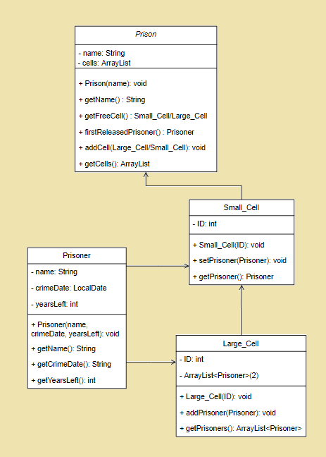

# Startdocument for Prison

Name: Levente Stieber
Student number 4843339
IT2B

## Problem description

The prison currently has all the files about its prisoners on paper. They want to digitalize all their files. The prison has several cells.
There are two types of cells: a small one and a large one. The small cell can hold one prisoner, a large cell two. The cell is identified by a cell number. The guards should be able to see which cells are currently have a free spot and which prisoner is in which cell. 
The application should also contain information about the prisoner, e.g. the date of the offence (dd-mm-yyyy), how many years he has to stay in prison.
The guards of the prison want to know which prisoner will be released first.

## Problem analysis

In the program, the user should be able to create a Prisoner(class) and input their details (name, date of offence, years to stay).
Cells can also be created by the user, either a small one(class), which has place for one, or a large one(class), which has place for two. The cell also must have a cell number.
Then, the Prisoner can be put in a cell - either a small one, or a large one.
In the Prison (class), the user can call a method to check which cells have free spot, and one to see which prisoner will be released first. 
Also a method should be made to check which prisoner is in which cell.

## Input & Output

In this section the input and output of the application will be described.

### Input

In the table below, all the input is described.

#### Input for class Prison

|   Case    |         Type          |       Condition      |
| --------- | --------------------- | -------------------- |
|   Name    |        String         |       Not null       |
|  addCell  |         Cell          |                      |

#### Input for class Prisoner

|   Case    |         Type          |       Condition      |
| --------- | --------------------- | -------------------- |
|    Name   |        String         |        Not null      |
|CrimeDate  |       LocalDate       |        Not null      |
|YearsLeft  |       double          |        Not null      |

#### Input for class Small cell

|   Case    |         Type          |       Condition      |
| --------- | --------------------- | -------------------- |
|    ID     |          int          |        Not null      |
|addPrisoner|         void          |Cell not containing Prisoner yet|

#### Input for class Large cell

|   Case    |         Type          |       Condition      |
| --------- | --------------------- | -------------------- |
|    ID     |          int          |        Not null      |
|addPrisoner|         void          |Cell not containing 2 Prisoners yet|

### Output 

#### Output for class Prison

| Case              | Type   |
| ----------------- | ------ |
| getName           | String |
| getFreeCell       |Small Cell/Large|
| firstReleasedPrisoner|Prisoner|

#### Output for class Prisoner

| Case              | Type   |
| ----------------- | ------ |
|      getName      | String |
|   getCrimeDate    | String |
|   getYearsLeft    | double |

#### Output for class Small cell

| Case              | Type   |
| ----------------- | ------ |
|       getID       |   int  |
|     getPrisoner   |Prisoner| Condition: If it has a prisoner |

#### Output for class Large cell

| Case              | Type   |
| ----------------- | ------ |
|       getID       |  int   |
|     getPrisoner   |ArrayList|

#### Remarks

Only the Main class can contain `System.out.println`.

## Diagram 

## Test plan 

In this section the testcases will be described in order to test the application.

|	Step number	|	Action		|	Input				|	Output						|
|:-------------:|:---------------------:|:-------------------------------------:|:-----------------------------------------------------:|
| 1 |	Prison()	|	Azkaban			|	Prison has been created				|
| 2 |	Prisoner()	|	Levente Stieber, 2021-10-04, 2.5|	Prisoner has been created		|
| 3 |	Prisoner()	|	Brendon Lakatos, 2018-05-02, 5.9|	Prisoner has been created		|
| 4 |   Prisoner()  |   Peesge Ogli, 2021-10-01, 4.3    |   Prisoner has been created       |
| 5 |	Small_Cell()	|		1		|	Small cell has been created				|
| 6 |	Large_Cell()	|	    2		|	Large cell has been created				|
| 7 |   Small_Cell()    |       3       |   Small cell has been created             |
| 8 |	setPrisoner()	|	Selected prisoner: Levente Stieber 	|	Prisoner has been added to cell number 1|
| 9 |	addPrisoner()  	|	Selected prisoner: Brendon Lakatos	|	Prisoner has been added to cell number 2|
| 10 |	addPrisoner()	|	Selected prisoner: Peesge Ogli	    |	Prisoner has been added to cell number 2|
| 11 |	getName() of first added prisoner|	 |	Levente Stieber		|
| 12 |	getCrimeDate() of second added prisoner	|	|	2018-05-02	|
| 13 |	getYearsLeft of third added prisoner	|	|4.3|
| 14 |	getPrisoners()	|	|	2 Prisoners(named Brendon Lakatos and Peesge Ogli)|
| 15 |	getPrisoner()	|	|	1 Prisoner(named Levente Stieber)|
| 16 |	getName() of Prison	|	|	Azkaban	|
| 17 |	getFreeCell()|	|Cell with ID number 3|
| 18 |	firstReleasedPrisoner()	|	|1 Prisoner(named Levente Stieber)|
| 19 |	getCells()	|	|	ArrayList of 3(ID #1, #2 and #3)|
