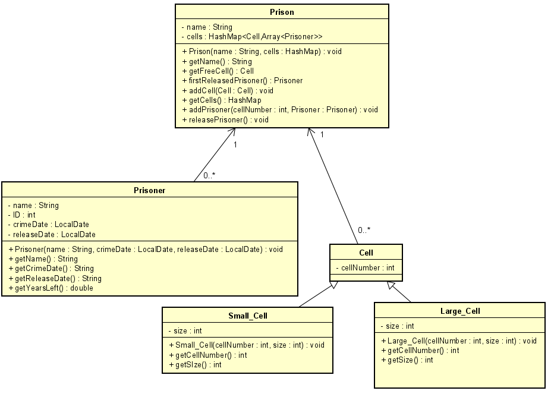

# Startdocument for Prison

Name: Levente Stieber  
Student number 4843339  
IT2B

## Problem description

The prison currently has all the files about its prisoners on paper. They want to digitalize all their files. The prison has several cells.
There are two types of cells: a small one and a large one. The small cell can hold one prisoner, a large cell two. The cell is identified by a cell number. The guards should be able to see which cells currently have a free spot and which prisoner is in which cell. 
The application should also contain information about the prisoner, e.g. the date of the offence (dd-mm-yyyy), how many years he has to stay in prison.
The guards of the prison want to know which prisoner will be released first.

## Problem analysis

In the program, the user should be able to create a Prisoner(class) and input their details (name, date of offence, release date).
Cells can also be created by the user, either a small one(class), which has place for one, or a large one(class), which has place for two. The cell also must have a cell number.
Then, the Prisoner can be put in a cell - either a small one, or a large one.
In the Prison (class), the user can call a method to check which cells have free spot, and one to see which prisoner will be released first. 
Also a method should be made to check which prisoner is in which cell.

## Input & Output

In this section the input and output of the application will be described.

### Input

In the table below, all the input is described.

#### Input for class Prison

|   Case    |         Type          |       Condition      |
| --------- | --------------------- | -------------------- |
|   Name    |        String         |       Not null       |
|  addCell  |         Cell          |                      |
|  addPrisoner  |Prisoner|Cell not containing the amount of Prisoners which equals the size of the Cell|
|  releasePrisoner  |   Prisoner    |                      |

#### Input for class Prisoner

|   Case    |         Type          |       Condition      |
| --------- | --------------------- | -------------------- |
|    Name   |        String         |        Not null      |
|CrimeDate  |       LocalDate       |        Not null      |
|releaseDate  |    LocalDate        |        Not null      |

#### Input for class Small cell

|   Case    |         Type          |       Condition      |
| --------- | --------------------- | -------------------- |
|  cellNumber   |        int        |        Not null      |

#### Input for class Large cell

|   Case    |         Type          |       Condition      |
| --------- | --------------------- | -------------------- |
|  cellNumber   |        int        |        Not null      |

### Output 

#### Output for class Prison

| Case              | Type   |
| ----------------- | ------ |
| getName           | String |
| getFreeCell       |Cell|
| firstReleasedPrisoner|Prisoner|
| getCells | HashMap |

#### Output for class Prisoner

| Case              | Type   |
| ----------------- | ------ |
|      getName      | String |
|   getCrimeDate    | String |
|   getCrimeDate    | String |
|   getYearsLeft    | double |

#### Output for class Small cell

| Case              | Type   |
| ----------------- | ------ |
|   getCellNumber   |   int  |
|     getSize   |    int     |

#### Output for class Large cell

| Case              | Type   |
| ----------------- | ------ |
|   getCellNumber   |   int  |
|     getSize   |    int     |

#### Calculations

|  Case  |                         Calculation                          |
| :----: | :----------------------------------------------------------: |
| getYearsLeft | The difference in years between today's date and the release date |

#### Remarks

- Input will be validated.
- Only the Main class will contain `System.out.println`
- Unit Tests will be provided.

## Class Diagram 

### Test Data

In the following table you'll find all the data that is needed for testing.

#### Prison

| ID           | Input                                           | Code                                                      |
| ------------ | ----------------------------------------------- | --------------------------------------------------------- |
| `name` | name: Azkaban | `new Prison("Azkaban")` |
| `cells` | new HasMap | `new HashMap<Cell, Array<Prisoner>` |

#### Prisoner

| ID           | Input                                           | Code                                                      |
| ------------ | ----------------------------------------------- | --------------------------------------------------------- |
| `name`, `crimeDate`, `releaseDate` | name: Levente Stieber, crime date: 2020-01-01, release date: 2022-01-01 | `new Prisoner("Levente Stieber", "2020-01-01", "2022-01-01")` |
| `name`, `crimeDate`, `releaseDate` | name: Brendon Lakatos, crime date: 2017-03-22, release date: 2024-03-22 | `new Prisoner("Brendon Lakatos", "2017-03-22", "2024-03-22")` |
| `name`, `crimeDate`, `releaseDate` | name: Ogli Peesge, crime date: 2019-10-04, release date: 2023-12-04 | `new Prisoner("Ogli Peesge", "2019-10-04", "2023-12-04")` |
| `name`, `crimeDate`, `releaseDate` | name: Csaba Tipszmiksz, crime date: 2018-05-10, release date: 2023-05-10 | `new Prisoner("Csaba Tipszmiksz", "2018-05-10", "2023-05-10")` |
| `name`, `crimeDate`, `releaseDate` | name: Lorinc Meszaros, crime date: 2012-03-03, release date: 2032-03-03 | `new Prisoner("Lorinc Meszaros", "2012-03-03", "2032-03-03")` |

#### Small Cell

| ID           | Input                                           | Code                                                      |
| ------------ | ----------------------------------------------- | --------------------------------------------------------- |
| `cellNumber, size` | cell number: 1, size: 1(constant) | `new Small_Cell(1, 1)` |

#### Large Cell

| ID           | Input                                           | Code                                                      |
| ------------ | ----------------------------------------------- | --------------------------------------------------------- |
| `cellNumber, size` | cell number: 2, size: 2(constant) | `new Large_Cell(1, 1)` |

### Test Cases

In this section the test cases will be described. Every test case should be executed with the test data as starting point.

#### #1 Add cells to the Prison

Adding our cells to the HashMap in Prison.

| Step | Input           | Action                       | Expected output                            |
| ---- | --------------- | ---------------------------- | ------------------------------------------ |
| 1    | `cells` | `addCell`(Small_Cell) | Small_Cell(#1) added to HashMap cells |
| 2    | `cells` | `addCell`(Large_Cell) | Large_Cell(#2) added to HashMap cells |
| 3    | `cells` | `addCell`(Large_Cell) | Large_Cell(#3) added to HashMap cells |

#### #2 Add Prisoners to the Cells

Adding Prisoners to the Array inside the HashMap.

| Step | Input           | Action                       | Expected output                            |
| ---- | --------------- | ---------------------------- | ------------------------------------------ |
| 1    | `prisoner` | `addPrisoner`(Levente Stieber) to small cell(#1) | Prisoner(Levente Stieber) added to Array Prisoners of cell #1 (in HashMap cells) |
| 2    | `prisoner` | `addPrisoner`(Brendon Lakatos) to large cell(#2) | Prisoner(Brendon Lakatos) added to Array Prisoners of cell #2 (in HashMap cells) |
| 3    | `prisoner` | `addPrisoner`(Ogli Peesge) to large cell (#2) | Prisoner(Ogli Peesge) added to Array Prisoners of cell #2 (in HashMap cells) |
| 4    | `prisoner` | `addPrisoner`(Csaba Tipszmiksz) to large cell (#2) | Prisoner(Csaba Tipszmiksz) cannot be added: cell is full |
| 5    | `prisoner` | `addPrisoner`(Csaba Tipszmiksz) to small cell (#1) | Prisoner(Csaba Tipszmiksz) cannot be added: cell is full |

#### #3 Remove, then add Prisoners to the Cells

Removing prisoner from full cell, then adding another to that cell.

| Step | Input           | Action                       | Expected output                            |
| ---- | --------------- | ---------------------------- | ------------------------------------------ |
| 1    | `prisoner` | `releasePrisoner`(Levente Stieber) from small cell(#1) | Prisoner(Levente Stieber) removed from Array Prisoners of cell #1 (in HashMap cells) |
| 2    | `prisoner` | `addPrisoner`(Csaba Tipszmiksz) to small cell(#1) | Prisoner(Csaba Tipszmiksz) added to Array Prisoners of cell #1 (in HashMap cells) |

#### #4 Checking the first released Prisoner

Method firstReleasedPrisoner should return the prisoner with the least yearsLeft.

| Step | Input           | Action                       | Expected output                            |
| ---- | --------------- | ---------------------------- | ------------------------------------------ |
| 1    | `firstReleasedPrisoner` | `firstReleasedPrisoner`| Prisoner named Csaba Tipszmiksz (because Levente Stieber had been removed before)  |
| 2    | `prisoner` | `addPrisoner`(Levente Stieber) to large cell(#3) | Prisoner(Levente Stieber) added to Array Prisoners of cell #3 (in HashMap cells) |
| 3    | `firstReleasedPrisoner` | `firstReleasedPrisoner`| Prisoner named Levente Stieber  |
| 4    | `prisoner` | `releasePrisoner`(Levente Stieber) from large cell(#3) | Prisoner(Levente Stieber) removed from Array Prisoners of cell #3 (in HashMap cells) |
| 5    | `firstReleasedPrisoner` | `firstReleasedPrisoner`| Prisoner named Csaba Tipszmiksz |

#### #5 Checking which cell has free spot

Method getFreeCell should return which cell has free spot.

| Step | Input           | Action                       | Expected output                            |
| ---- | --------------- | ---------------------------- | ------------------------------------------ |
| 1    | `getFreeCell` | `getFreeCell`| Cell #3 has free spot.  |
| 2    | `prisoner` | `addPrisoner`(Levente Stieber) to large cell(#3) | Prisoner(Levente Stieber) added to Array Prisoners of cell #3 (in HashMap cells) |
| 3    | `prisoner` | `addPrisoner`(Lorinc Meszaros) to large cell(#3) | Prisoner(Lorinc Meszaros) added to Array Prisoners of cell #3 (in HashMap cells) |
| 4    | `getFreeCell` | `getFreeCell`| No cells have a free spot.  |
| 5    | `prisoner` | `releasePrisoner`(Levente Stieber) from large cell(#3) | Prisoner(Levente Stieber) removed from Array Prisoners of cell #3 (in HashMap cells) |
| 6    | `getFreeCell` | `getFreeCell`| Cell #3 has free spot.  |
| 7    | `prisoner` | `addPrisoner`(Levente Stieber) to large cell(#3) | Prisoner(Levente Stieber) added to Array Prisoners of cell #3 (in HashMap cells) |
| 8    | `prisoner` | `releasePrisoner`(Csaba Tipszmiksz) from small cell(#1) | Prisoner(Csaba Tipszmiksz) removed from Array Prisoners of cell #1 (in HashMap cells) |
| 9    | `getFreeCell` | `getFreeCell`| Cell #1 has free spot.  |

#### #6 Checking which Cell has which Prisoner in it

Method getCells returns a HashMap with the Cells and their Array of Prisoners.

| Step | Input           | Action                       | Expected output                            |
| ---- | --------------- | ---------------------------- | ------------------------------------------ |
| 1    | `getCells` | `getCells`| HashMap of Cells: 3 cells, #1(small), #2 and #3. #1 should have an empty Array, #2 and #3 should have Arrays with 2 Prisoners each.(Brendon Lakatos and Ogli Peesge in #2, Levente Stieber and Lorinc Meszaros in #3)  |
| 2    | `prisoner` | `releasePrisoner`(Levente Stieber) from large cell(#3) | Prisoner(Levente Stieber) removed from Array Prisoners of cell #3 (in HashMap cells) |
| 3    | `getCells` | `getCells`| HashMap of Cells: 3 cells, #1(small), #2 and #3. #1 should have an empty Array, #2 should have Arrays with 2 Prisoners(Brendon Lakatos and Ogli Peesge), and #3 an Array with 1 Prisoner(Lorinc Meszaros).  |
